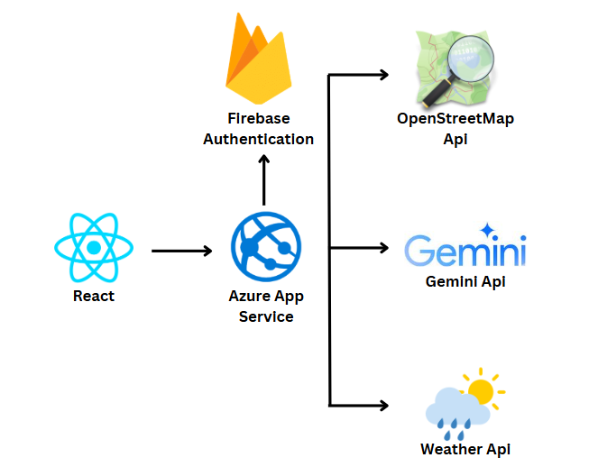

# 🌱 Project Overview

AgriMind is a smart farming web app using AI and real-time data to support Malaysian farmers with weather forecasts, crop insights, risk alerts, and pest detection for better yield and sustainability. 🌾📊🌦️

## 🌟 Features

-🏠 Homepage Dashboard
Overview of real-time weather, interactive field map, latest risk alerts, and quick access to all key tools.

-🌦️ Weather Page
Displays 12 Malaysian states' weather data including temperature, humidity, and forecasts for smarter planning.

-🗺️ Field Map Page
Filter by crop (All, Rice, Corn) with region-specific data like temp, soil moisture, weather, and forecast yield. Includes map-based field popups and yield history charts. Includes AI-powered 2025 yield predictions based on real-time weather, soil, and historical yields, visualized with a 3D model.

-🚨 Risk Dashboard Page
Visualizes temperature, humidity, and wind data with risk heatmaps (High, Medium, Low). Includes notification logs and risk source breakdowns (weather, soil, pest, etc.). AI assistant predicts which states face risks (e.g., floods, pests) in coming weeks, along with severity and confidence level, based on environment and growth stages.

-🤖 AI Assistant Page
Ask farming-related questions in natural language (e.g., best planting times, fertilizer tips). Powered by Gemini API with localised advice.

-🐛 Pest Detection Page
Upload pest images to identify species and get crop impact insights using AI image analysis.

-📈 Analytics & Reports Page
Graphs for monthly yield comparison, price trends, and income simulation. Option to download reports for corn and rice. AI analyzes seasonal patterns and economic factors to forecast next 3-month price range (RM/ton), including direction, reason, and confidence level. Reports exportable as PDF.

### 🏗️ System Architecture

### 🛠️ Technology Stack

-Frontend: React.js, MUI (Material UI), Framer Motion

-Backend & Hosting: Firebase Authentication, Gemini API, Azure App Service

-Mapping & Geolocation: Leaflet.js, OpenStreetMap API

-Weather Integration: OpenWeather API

-AI & Data Intelligence: Gemini API (AI Assistant), Custom Pest Detection Model

-Charting & Visualization: Chart.js, Recharts

-File & Report Handling: PDF generation & download for yield reports

### 📚 References

🌐 Website: [AgriMind](https://calm-bay-0de3d2900.6.azurestaticapps.net)

### 👥 Team DataSquad

-👨‍💻 Goh Sin Hua – Full-stack developer & system architect, led the integration of AI, Firebase, and weather APIs.

-👨‍💻 Alan Koo Ngee Xun – UI/UX designer & data analyst, responsible for interactive mapping, risk dashboard logic, and report generation.

## 📄 License

© 2025 AgriMind by Team DataSquad. All rights reserved.

🛑 Code is provided strictly for reference purposes only.

❌ No use, modification, or distribution is allowed without prior written permission from the developers.

